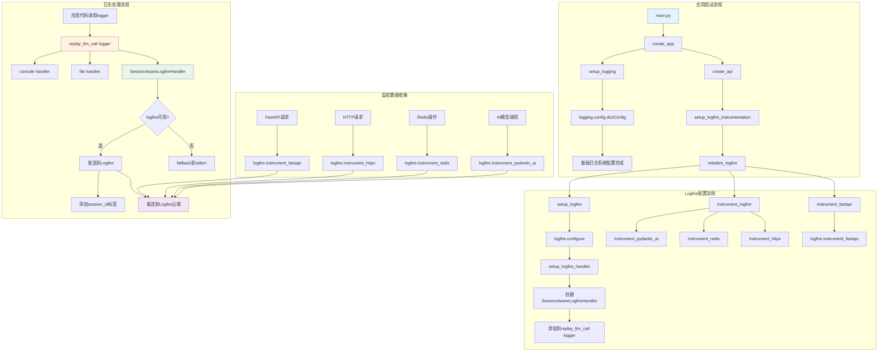
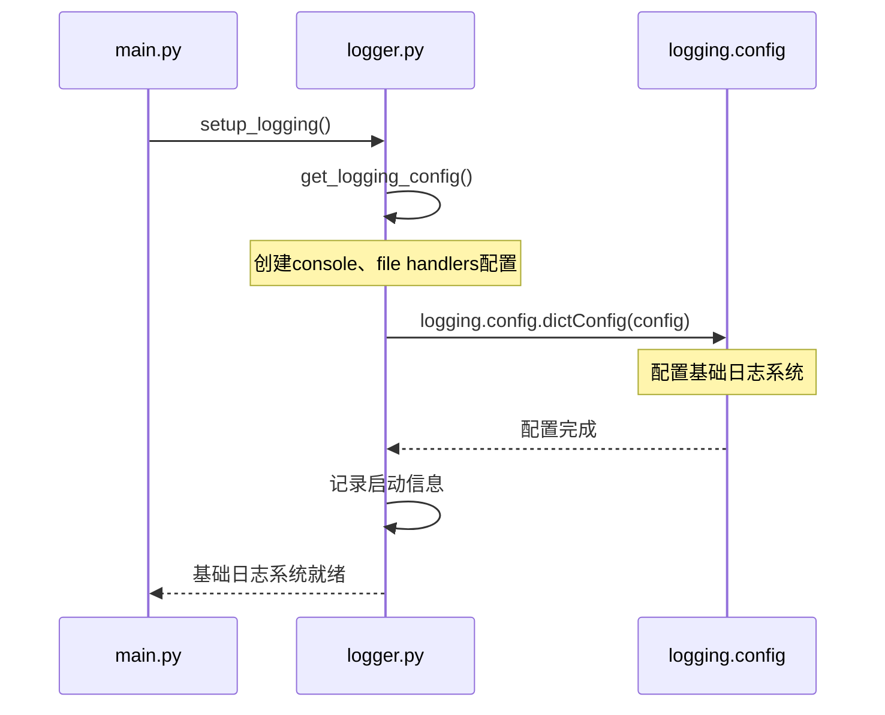
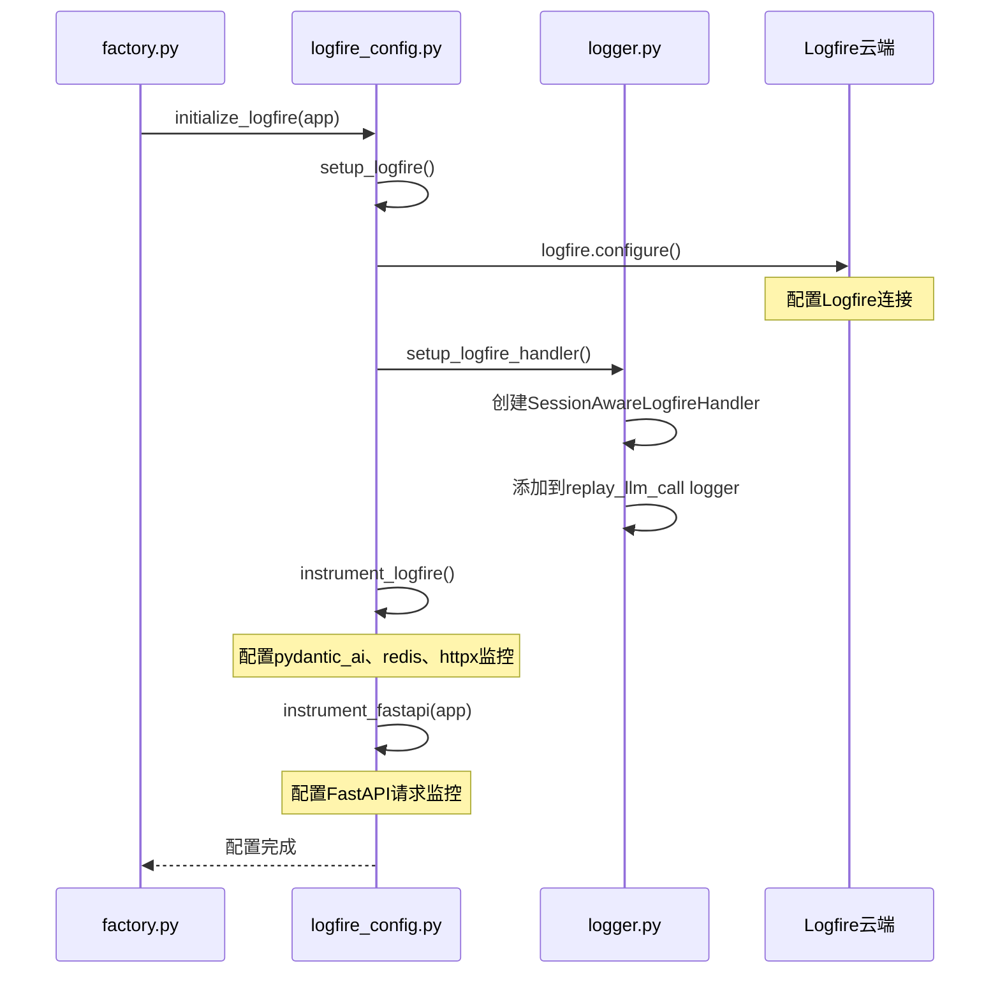
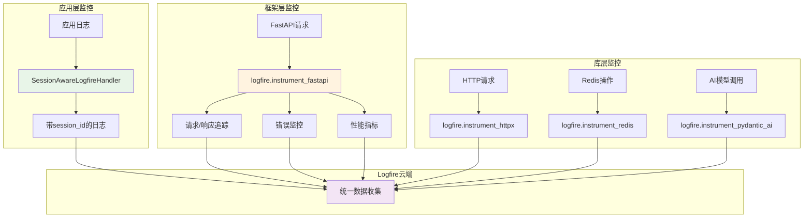
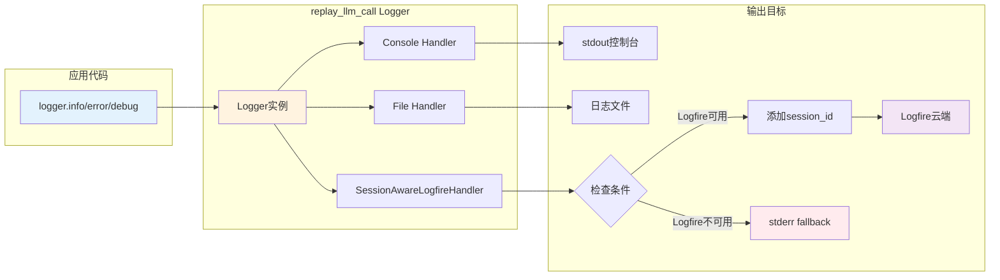

# Logfire与Logging协作机制详解

本文档详细说明了replay-llm-call项目中Logfire与Python标准logging库的协作机制。

## 🏗️ 整体架构设计

我们的项目采用了**双层日志架构**：
1. **标准Python Logging** - 基础日志系统
2. **Logfire集成** - 高级监控和可观测性

### 架构总览图



## 📋 核心组件

### 1. 基础日志系统 (`src/core/logger.py`)

- **`setup_logging()`**: 配置基础日志系统
- **`get_logging_config()`**: 生成日志配置
- **`SessionAwareLogfireHandler`**: 自定义Logfire处理器
- **`setup_logfire_handler()`**: 配置Logfire日志处理器

### 2. Logfire配置模块 (`src/core/logfire_config.py`)

- **`setup_logfire()`**: 基础Logfire配置
- **`instrument_logfire()`**: 库级别监控配置
- **`instrument_fastapi()`**: FastAPI监控配置
- **`initialize_logfire()`**: 完整初始化流程

## 🔄 启动流程

### 阶段1: 基础日志系统配置

```python
# main.py -> create_app()
setup_logging()  # 1️⃣ 先设置基础日志系统
```

**配置内容**：
- Console Handler (stdout)
- File Handler (日志文件，支持轮转)
- Logger配置 (`replay_llm_call` logger)

#### 基础日志系统配置流程图



### 阶段2: Logfire集成配置

```python
create_api()                        # 2️⃣ 创建FastAPI应用
setup_logfire_instrumentation()     # 3️⃣ 设置Logfire监控
```

**配置内容**：
- Logfire基础配置 (`logfire.configure()`)
- 添加SessionAwareLogfireHandler到现有logger
- 配置各种库的监控 (pydantic_ai, redis, httpx)
- 配置FastAPI请求监控

#### Logfire集成配置流程图



## 🎯 核心特性

### 1. SessionAwareLogfireHandler智能处理

```python
class SessionAwareLogfireHandler(logging.Handler):
    def emit(self, record):
        # 1️⃣ 检查Logfire是否可用
        if logfire is None:
            self.fallback.emit(record)  # 降级到stderr
            return
            
        # 2️⃣ 检查是否被抑制（避免循环）
        ctx = get_current()
        try:
            # 尝试现代API (.get方法)
            if ctx.get(_SUPPRESS_INSTRUMENTATION_KEY, False):
                self.fallback.emit(record)
                return
        except AttributeError:
            try:
                # 尝试旧版API (.get_value方法)
                if ctx.get_value(_SUPPRESS_INSTRUMENTATION_KEY):
                    self.fallback.emit(record)
                    return
            except (AttributeError, TypeError, KeyError):
                # 如果都失败，继续正常日志记录
                pass
            
        # 3️⃣ 添加session_id标签
        session_id = get_session_id()
        if session_id:
            logfire_with_session = logfire.with_tags(f"sid:{session_id}")
        
        # 4️⃣ 发送到Logfire
        logfire_with_session.log(...)

    # Fallback handler配置
    fallback_handler.addFilter(lambda record: not record.name.startswith("urllib3"))
```

**关键特性**：
- **智能降级**: Logfire不可用时自动使用fallback
- **会话感知**: 自动添加session_id标签
- **循环避免**: 检测并避免instrumentation循环
- **语义正确**: 使用`fallback.emit()`而非`fallback.handle()`
- **版本兼容**: 支持OpenTelemetry不同版本的Context API (`.get()`和`.get_value()`)
- **幂等性**: 多次调用`setup_logfire_handler()`是安全的
- **噪音过滤**: 过滤urllib3等库的调试日志

### 2. 多层监控体系

#### 应用层监控
- 应用代码的日志通过SessionAwareLogfireHandler发送
- 自动添加session_id和上下文信息

#### 框架层监控
- FastAPI请求/响应追踪
- 错误监控和性能指标
- 自定义请求属性映射

#### 库层监控
- HTTP请求监控 (httpx)
- Redis操作监控
- AI模型调用监控 (pydantic_ai)

#### 多层监控体系图



### 3. 数据安全与过滤

#### 敏感信息过滤
```python
def _custom_scrub_callback(match):
    # 允许session_id字段，过滤其他敏感信息
    allowed_keys = {"session_id", "sid"}
    if any(str(part).lower() in allowed_keys for part in match.path):
        return match.value
    return None  # 其他敏感信息被过滤
```

#### 请求属性映射
```python
def custom_request_attributes_mapper(request, attributes):
    # 过滤敏感信息，保留有用的调试数据
    # 特别处理session_id字段
    # 文件上传只记录文件名和大小
```

## 🚀 运行时日志处理流程

### 日志记录流程

1. **应用代码调用**: `logger.info("message")`
2. **Logger分发**: `replay_llm_call` logger接收
3. **多Handler处理**:
   - Console Handler → stdout控制台
   - File Handler → 日志文件
   - SessionAwareLogfireHandler → Logfire云端

#### 运行时日志处理流程图



### 条件处理

```python
# SessionAwareLogfireHandler的处理逻辑
if logfire_available:
    if session_id_exists:
        logfire.with_tags(f"sid:{session_id}").log(...)
    else:
        logfire.log(...)
else:
    fallback_handler.emit(record)  # 降级到stderr
```

## 💡 设计优势

### 1. 渐进式增强
- **基础功能**: 即使Logfire不可用，标准日志仍正常工作
- **增强功能**: Logfire可用时提供高级监控和可观测性

### 2. 智能降级
- **网络问题**: 自动fallback到本地日志
- **配置错误**: 不影响应用正常运行
- **依赖缺失**: 优雅降级到基础日志

### 3. 会话感知
- **Session ID**: 自动添加会话标识
- **请求追踪**: 跨服务的请求链路追踪
- **上下文保持**: 维护请求上下文信息

### 4. 职责分离
- **基础日志**: 由`logger.py`负责
- **Logfire集成**: 由`logfire_config.py`负责
- **清晰边界**: 各模块职责明确

## 🔧 版本兼容性

### OpenTelemetry Context API兼容性

我们的代码支持不同版本的OpenTelemetry Context API：

```python
# 现代版本 (OpenTelemetry >= 1.15.0)
ctx = get_current()
if ctx.get(_SUPPRESS_INSTRUMENTATION_KEY, False):
    # 处理抑制逻辑

# 旧版本 (OpenTelemetry < 1.15.0)
ctx = get_current()
if ctx.get_value(_SUPPRESS_INSTRUMENTATION_KEY):
    # 处理抑制逻辑
```

**兼容性处理策略**：
1. **优先尝试现代API**: 使用`.get(key, default)`方法
2. **降级到旧版API**: 如果现代API不可用，尝试`.get_value(key)`方法
3. **优雅降级**: 如果都不可用，继续正常日志记录而不是崩溃

**支持的OpenTelemetry版本**：
- ✅ **1.15.0+**: 现代Context API
- ✅ **1.0.0 - 1.14.x**: 旧版Context API
- ✅ **未安装**: 优雅降级到标准日志

## 🔧 配置要点

### 环境变量配置

```bash
# 启用Logfire
LOGFIRE__ENABLED=true
LOGFIRE__SERVICE_NAME=replay_llm_call
LOGFIRE__ENVIRONMENT=development

# 监控配置
LOGFIRE__INSTRUMENT__FASTAPI=true
LOGFIRE__INSTRUMENT__HTTPX=true
LOGFIRE__INSTRUMENT__REDIS=true
LOGFIRE__INSTRUMENT__PYDANTIC_AI=true

# 安全配置
LOGFIRE__DISABLE_SCRUBBING=false
LOGFIRE__HTTPX_CAPTURE_ALL=true
```

### 代码中的使用

```python
# 获取logger
logger = get_logger(__name__)

# 记录日志（会同时发送到console、file、logfire）
logger.info("用户操作", extra={
    "user_id": "123", 
    "session_id": "abc",
    "action": "login"
})

# 设置会话ID（用于日志关联）
from src.core.logger import set_session_id
set_session_id("session_abc_123")
```

## 🎯 最佳实践

### 1. 日志级别使用
- **DEBUG**: 详细的调试信息
- **INFO**: 一般信息和业务流程
- **WARNING**: 警告信息
- **ERROR**: 错误信息

### 2. 噪音过滤
```python
# 过滤第三方库的调试日志
fallback_handler.addFilter(lambda record: not record.name.startswith("urllib3"))

# 更复杂的过滤规则
def custom_filter(record):
    # 过滤多个库的调试日志
    noisy_loggers = ["urllib3", "requests.packages.urllib3", "httpx"]
    return not any(record.name.startswith(name) for name in noisy_loggers)

fallback_handler.addFilter(custom_filter)
```

### 3. 结构化日志
```python
logger.info("API调用", extra={
    "endpoint": "/api/v1/test",
    "method": "POST",
    "response_time": 0.123,
    "status_code": 200
})
```

### 4. 会话管理
```python
# 在请求开始时设置
set_session_id(request_id)

# 在请求结束时清理
clear_session_id()
```

## 🔍 故障排查

### 常见问题

1. **Logfire不工作**: 检查`LOGFIRE__ENABLED`和网络连接
2. **日志重复**: 检查handler是否重复添加
3. **性能问题**: 调整日志级别和采样率
4. **OpenTelemetry版本兼容**: 支持不同版本的Context API (`.get()`和`.get_value()`)
5. **Handler重复配置**: `setup_logfire_handler()`具有幂等性，自动避免重复添加

### 调试方法

```python
# 检查Logfire状态
from src.core.logfire_config import is_logfire_enabled
print(f"Logfire enabled: {is_logfire_enabled()}")

# 检查handler配置
logger = logging.getLogger("replay_llm_call")
print(f"Handlers: {[type(h).__name__ for h in logger.handlers]}")

# 如果需要重新配置，可以直接移除handler
logger = logging.getLogger("replay_llm_call")
logger.handlers = [h for h in logger.handlers if not isinstance(h, SessionAwareLogfireHandler)]
```

这种设计确保了**可靠性**、**可观测性**和**可维护性**的完美平衡！
